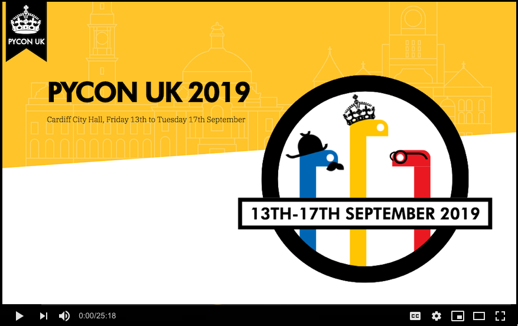
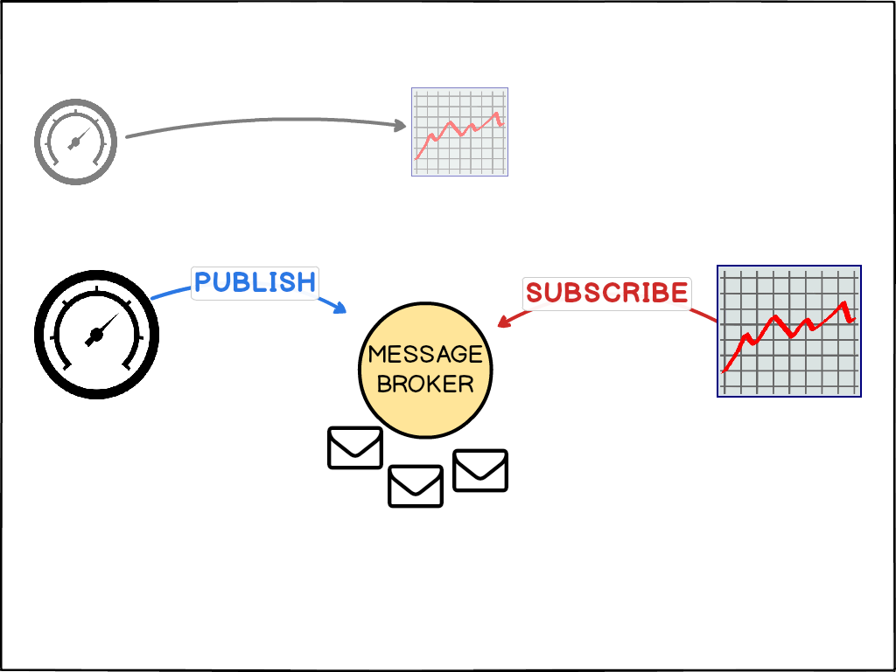
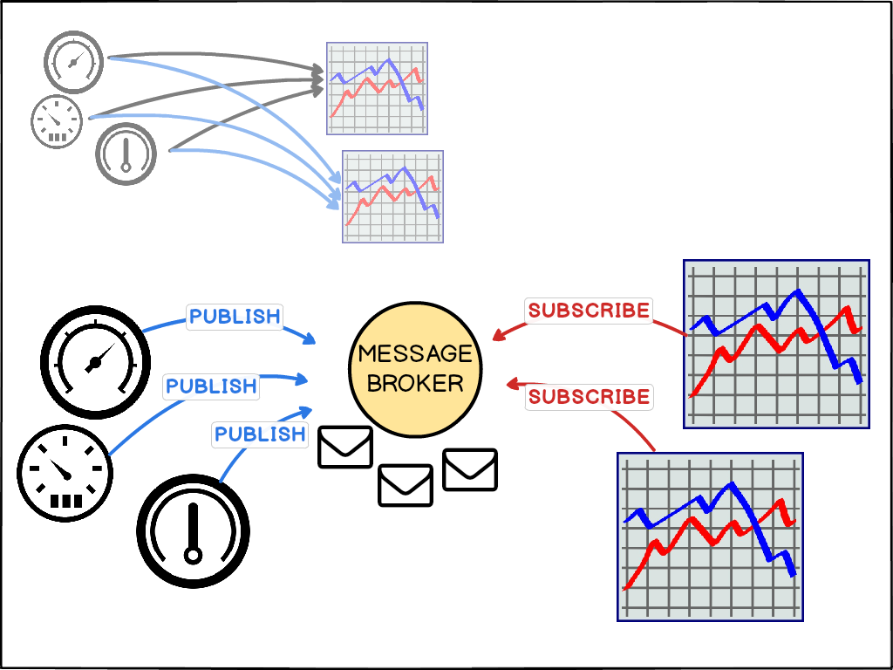
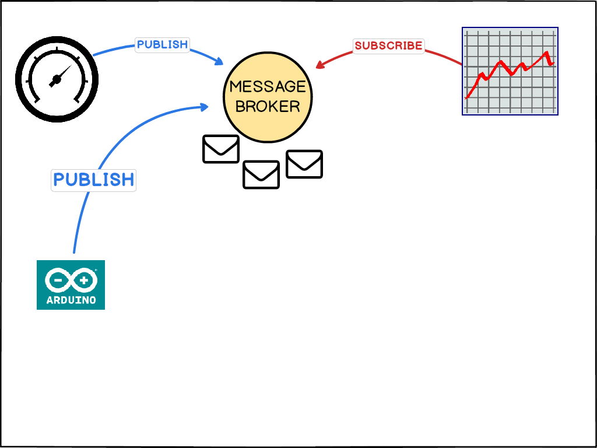
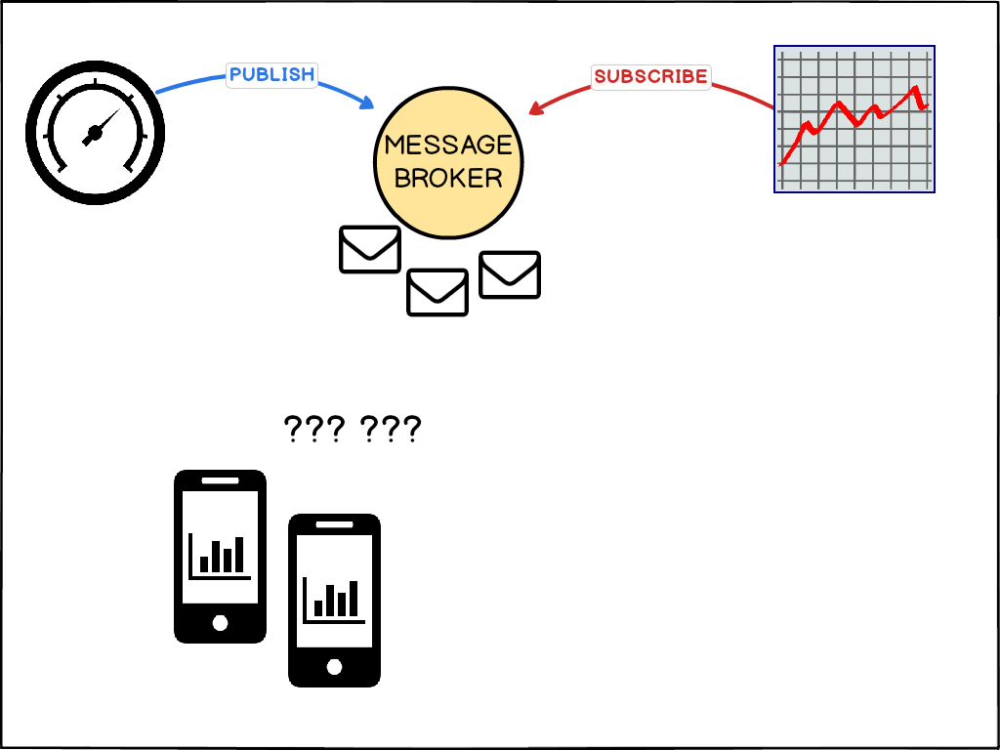
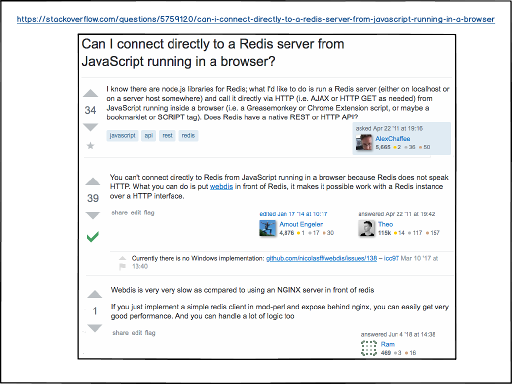
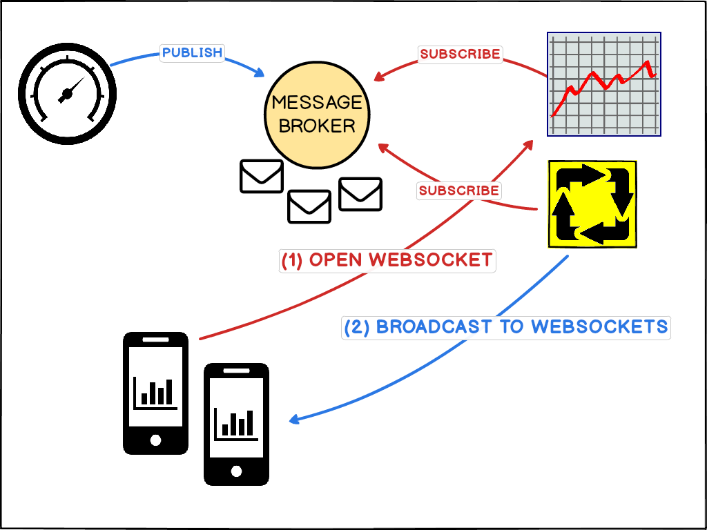

Sinewave
========

# Real-time data acquisition, from Arduino to the web, using PubSub with Redis, Django and other friends

## Abstract

I'll apply PubSub to collect data in real-time from TCP-enabled peripherals,
like Arduino or others, and deliver them to a data server for storage, processing,
and broadcasting to remote clients (typically smartphones or tablets) for real-time
monitoring and inspection.

## Content

We all know and love our fancy web framework, but when it comes to collecting data
in real-time from remote devices, we have to take a step in a new direction.

This talk aims to add an extra dimension to the skills of Python/Django developers,
who may be familiar with processes and techniques involved in data publishing,
but would like to explore new ways of collecting data in the first place.

The talk covers data collection, processing and publishing.

**Collection**: TCP-enabled devices such as Arduino make it possible to collect
real-time data extremely cheaply and simply. I will demonstrate how easy it is
to deliver data from such devices to our data servers, using robust PubSub
communication patterns.

**Processing**: a Python backend provides multiple options for processing data and
extracting useful information and insights.

**Publishing**: to complete the cycle, the information must be delivered in real-time
to the user in a comprehensible, usable form; we’ll assume our users are working
in the field with smartphones or tablets.

## Target audience

I will assume that my audience has a basic understanding of Python and Django,
and build on that to introduce tools (Redis, Arduino) and techniques
(PubSub, real-time messaging, Django Channels) in a practical context.

We'll dig into the code of several practical use cases, to explore how the solution
can be adapted to different scenarios.

The software technologies selected for this purpose are: Python, Redis and Django Channels.

## Videos

**PyCon UK 2019**: Real-time data acquisition, from Arduino to the web, using PubSub with Redis, Django and other friends

**PyCon Italia 2019**: Internet delle cose con Redis e django-channels

## Demo site

[https://sinewave.brainstorm.it](https://sinewave.brainstorm.it)

## Slides

[Download slides as PDF](https://github.com/morlandi/sinewave/raw/master/etc/slides/2019-05-03_PyconItalia2019_sinewave.pdf)

## References

- [Redis: an open source (BSD licensed), in-memory data structure store, used as a database, cache and message broker](https://redis.io)
- [Django Channels: Developer-friendly asynchrony for Django](https://github.com/django/channels)
- [redis-py: The Python interface to the Redis key-value store.](https://github.com/andymccurdy/redis-py)
- [Redis on Windows: Getting Started](https://channel9.msdn.com/Blogs/Interoperability/Redis-on-Windows-Getting-Started)
- [Redis for ESP8266 (Arduino Library)](https://www.arduinolibraries.info/libraries/redis-for-esp8266)
- [Can I connect directly to a Redis server from JavaScript running in a browser?](https://stackoverflow.com/questions/5759120/can-i-connect-directly-to-a-redis-server-from-javascript-running-in-a-browser)

